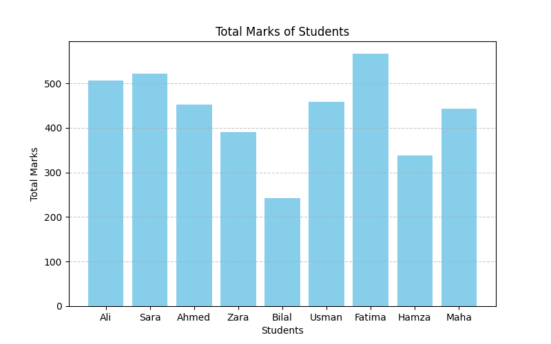
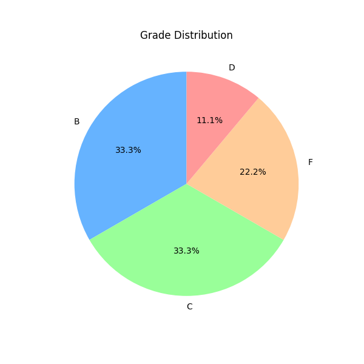

# 🎓 Student Result Analyzer

A Python Data Science project that reads student marks from a CSV file, calculates total scores, assigns grades, and visualizes performance using bar and pie charts.

## 📦 Tools
- Python
- Pandas
- Matplotlib

## 📊 Features
✅ Read marks from CSV  
✅ Compute total and average  
✅ Assign grades automatically  
✅ Visualize data using graphs  

## 📈 Example Charts

## 🚀 Run
1. Clone the repo 
2. Run the notebook in VS Code or Jupyter  
3. See the results in the dashboard!

## 📜 Explaination
"A beginner friendly Data Science project built with Python that processes student marks from a CSV file, calculates totals and averages, assigns gradesautomatically and visualizes results with insightful charts" Great example of data analysis and visualization using Pandas and Matplotlib!

